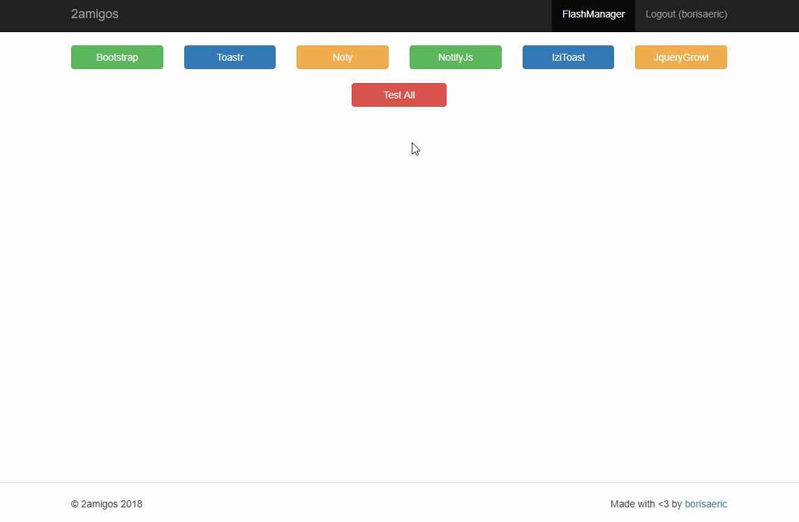

# yii2-flash-manager
Flash manager for Yii 2+



# Usage
Add flash component configuration in you application config and also make sure
to add it to bootstrap:

```php
[
    'bootstrap' => ['flash'],
    'components' => [
        'flash' => [
            'class' => '\dvamigos\Yii2\FlashManager\Flash',
        ],
    ],
]
```

Then in your code you can set various flash messages using:
```php
Yii::$app->flash->add('message', 'type');
```
This will set flash message in session.

# Flash message types
By default there is 4 helper methods to add flash messages:
```php
Yii::$app->flash->success('message');
Yii::$app->flash->error('message');
Yii::$app->flash->info('message');
Yii::$app->flash->warning('message');
```

# Flash message category
You can have different categories in order to use it at various spots.
Category can be set in:
```php
Yii::$app->flash->add('messsage', 'type', 'category');
```
or in helper methods
```php
Yii::$app->flash->success('message', 'category');
Yii::$app->flash->error('message', 'category');
Yii::$app->flash->info('message', 'category');
Yii::$app->flash->warning('message', 'category');
```

# Displaying flash messages
There is 6 types of widgets in order to render flashes.
You can use `clientOptions` to configure plugins.
Look at plugins documentation to learn more.
- Bootstrap [Documentation]()
- IziToast [Documentation](http://izitoast.marcelodolce.com/)
- Noty [Documentation](https://ned.im/noty/#/)
- NotifyJs [Documentation](https://notifyjs.jpillora.com/)
- JqueryGrowl [Documentation](https://ksylvest.github.io/jquery-growl/)
- Toastr [Documentation](https://codeseven.github.io/toastr/)

Samples of rendering widgets:
```php
<?= \dvamigos\Yii2\FlashManager\Bootstrap\BootstrapFlash::widget([
    // 'category' => 'Bootstrap', by default category value is 'default'
    // and you can ommit it if you don't handle different categories
]); ?>

<?= \dvamigos\Yii2\FlashManager\IziToast\IziToastFlash::widget([
    'category' => 'user-settings-page',
    'clientOptions' => [
            'close' => false,
    ]
]); ?>

<?= \dvamigos\Yii2\FlashManager\NotifyJs\NotifyJsFlash::widget([
    'clientOptions' => [
        'clickToHide' => false,
        'globalPosition' => 'top left',
    ]
]) ?>

<?= \dvamigos\Yii2\FlashManager\JqueryGrowl\JqueryGrowlFlash::widget() ?>

<?= \dvamigos\Yii2\FlashManager\Toastr\ToastrFlash::widget([
    'clientOptions' => [
        'progressBar' => true,
        'positionClass' => 'toast-bottom-center',
    ]
]) ?>

<?= \dvamigos\Yii2\FlashManager\Noty\NotyFlash::widget([
    'clientOptions' => [
            'layout' => 'bottomLeft',
    ]
]) ?>
```
